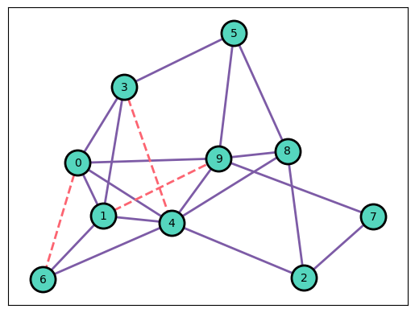

# Link Prediction in Python



Networks can describe a great variety of systems, from social networks to complex information systems. It is of crucial importance that these networks accurately model the real-world systems. *Link prediction* is the task of classifying the reliability of links in observed networks, and to identify links that are missing from the observed network. Depending on the network, link prediction is used to improve the accuracy of the network in case of missing data errors, predict the future system, or recommend links between nodes that could be connected based on their characteristics.

In this repository, we implemented two common paradigms of link prediction: Similarity-based link prediction and Maximum-likelihood link prediction. For the former, 20 metrics are implemented from a popular survey paper [3]. For the latter, HSM and SBM approaches from [1], [2] are implemented. These methods can be applied on any unweighted undirected graph, like the ones created in `make_data.py`. To test the metrics, you can use `main.py` with the arguments listed under *Running instructions* below. For a more formal introduction to the topic, we refer to the papers or the example notebook `notebooks/link_prediction.ipynb`.

If you take inspiration from this repository, make sure you give some credit :) it would be greatly appreciated.

## Similarity-based link prediction
Similarity-based link prediction methods are based around the idea that similar nodes are likely to be connected. 
Consider a social media network, where nodes are users and edges are connections. If two users share a lot of connections,
it is very plausible that these users know eachother. 

Similarity-based link predictions use a similarity metric $S(u,v): N \times N \rightarrow \mathbb{R}$ is used to determine the similarity between nodes. A link is classified as missing if it is not currently in the network $(u,v) \notin G$ and the similarity score is meets some threshold $S(u,v) \geq t$ where $t$ is the threshold.

A popular $S$ is the Common Neighbors index: $S^\text{CN}(u,v) = | \Gamma(u) \cap \Gamma(v) |$ where $\Gamma(u)$ contains all $u$-adjacent nodes. In the social media example, this metric would look to connect users with many shared connections.

In this repository, we implement all similarity-based metrics described in [3]. Below is a table that lists the metric name, index (in paper [3]), and the method name used in this repository:

| Metric | Id | Method Name |
|--------|----|-------------|
| Common Neighbors | 1 | `similarity_common_neighbors` |
| Salton Index | 2 | `similarity_salton_index` |
| Jaccard Index | 3 | `similarity_jaccard_index` |
| Sorenson Index | 4 | `similarity_sorenson_index` |
| Hub Promoted Index | 5 | `similarity_hub_promoted_index` |
| Hub Depressed Index | 6 | `similarity_hub_depressed_index` |
| LHN1 Index | 7 | `similarity_leicht_holme_newman_index` |
| Preferential Attachment Index | 8 | `similarity_preferential_attachment_index` |
| Adamic Adar Index | 9 | `similarity_adamic_adar_index` |
| Resource Allocation Index | 10 | `similarity_resource_allocation_index` |
| Katz Index | 11 | `similarity_katz_index` |
| LHN2 Index | 12 | `similarity_LHN2` |
| Average Commute Time | 13 | `similarity_average_commute_time` |
| Cosine Based on Partial-Inverted Laplacian | 14 | `similarity_cosine_pinv_laplacian` |
| Random Walk with Restart | 15 | `similarity_random_walk_with_restart` |
| SimRank | 16 | `similarity_simrank` |
| Matrix Forest Index | 17 | `similarity_matrix_forest_index` |
| Local Path Index | 18 | `similarity_local_path_index` |
| Local Random Walk | 19 | `similarity_local_random_walk` |
| Superposed Random Walk | 20 | `similarity_superposed_random_walk` |

## Maximum-Likelihood link prediction
Networks may have characteristic structures such as groups. To this extent, we may want to presuppose some properties of a network when building a link prediction algorithm. Maximum-likelihood estimation can be applied on some null model, like the Stochastic Block Model, to determine the reliability of (missing) links based on their structural properties. 

Both methods implemented in this repository implement the Metropolis-Hastings MCMC algorithm to sample efficiently according to the likelihood of a group of link prediction models. 

The Hierarchical Structure Model (HSM) imposes a hierarchical structure on the graph and samples dendrograms based on the lowest common ancestor product of all links in an observed graph. After sufficient iterations of the MH algorithm, we can sample dendrograms that represent the observed graph with high likelihood. These dendrograms can then be used to make an ensemble estimation for link reliabilities. 

Alternatively, we can assume the graph is distributed according to a Stochastic Block Model (SBM) and use maximum-likelihood estimation to sample from the space of all possible block models. After sufficient burn-in time, we can sample block models for ensemble estimation of link reliabilities.

There is no definitive answer for which of the two ML approaches is better, it depends on the assumptions we want to make on the structure of the network generation function.

## Running instructions
To use `main.py`, follow the instructions below:

1. **Prepare your data**: Ensure your input graph is an unweighted, undirected graph. You can create such graphs using `make_data.py` or provide your own graph in an appropriate format.

2. **Run the script**: Execute `main.py` from the command line with the following arguments:
    ```
    python main.py --input <path_to_graph_file> --method <method_name> [--threshold <value>] [--output <path_to_output_file>]
    ```
    - `--input`: Path to the input graph file.
    - `--method`: The link prediction method to use. Choose from the method names listed in the tables above (e.g., `similarity_common_neighbors`, `similarity_jaccard_index`, etc.).
    - `--threshold` (optional): Threshold value for similarity-based methods. Default is 0.5.
    - `--output` (optional): Path to save the output predictions. If not provided, results will be printed to the console.

3. **Example usage**:
    - To predict links using the Common Neighbors method:
      ```
      python main.py --input data/graph.txt --method similarity_common_neighbors --threshold 4 --output results/predictions.txt
      ```
    - To use the Hierarchical Structure Model (HSM):
      ```
      python main.py --input data/graph.txt --method hsm --output results/hsm_predictions.txt
      ```

4. **Output**: The script will output the predicted links along with their reliability scores. If an output file is specified, the results will be saved in that file.

For more details on the arguments and methods, refer to the documentation in the code or the descriptions above.

## References
[1] Clauset, A., Moore, C., & Newman, M. E. (2008). Hierarchical structure and the prediction of missing links in networks. Nature, 453(7191), 98-101.

[2] Guimerà, R., & Sales-Pardo, M. (2009). Missing and spurious interactions and the reconstruction of complex networks. Proceedings of the National Academy of Sciences, 106(52), 22073-22078.

[3] Lü, L., & Zhou, T. (2011). Link prediction in complex networks: A survey. Physica A: statistical mechanics and its applications, 390(6), 1150-1170.
